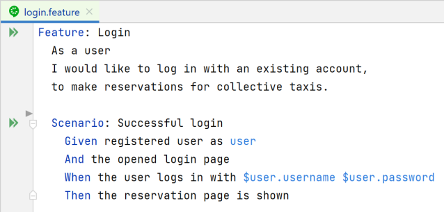
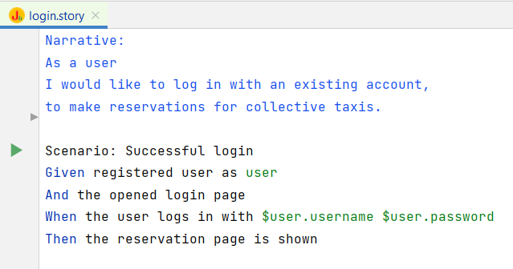

# bdd-web-app

Use proven patterns for your behavior-driven test project. You can write the executable specifications in Cucumber and JBehave and benefit from years of web-application test automation experience.

The opinionated test framework "bdd-web-app" should solve the usual technical issues for web application regression tests.
It is based on Spring, Selenium, and Rest-assured. It can work with Cucumber or with JBehave and can be understood as a Plugin for these frameworks.
The framework will help you managing test data in the lifecycle. The browser instrumentalization driver will be updated automatically. And further, you can work with spring in your test project.

The included sample project allows a quick introduction to the test framework.

## Features

- Test data lifecycle.
- Access test data in Cucumber or JBehave with $. I.e., "Given account $myaccount".
- Automatic webdriver updates.
- Use Spring in your test project.
- Optional extension of Selenium-Web-Element.

## Cucumber 

Lean Cucumber extension for application testing.



### Maven dependency

If you want to use Cucumber for your web application test project, add this maven dependency. The dependency includes Cucumber, Spring, Selenium, Webdrivermanager, and other components.

```xml
            <dependency>
                <groupId>de.telekom.test</groupId>
                <artifactId>bddwebapp-cucumber</artifactId>
                <version>2.1</version>
            </dependency>
```

The framework is also available for other build-automation tools like Gradle. You will find the artifacts here: https://search.maven.org/artifact/de.telekom.test/bddwebapp-cucumber/2.1/jar.

## JBehave

JBehave extension for application testing.



### Maven dependency

If you want to use JBehave for your web application test project, add this maven dependency. The dependency includes JBehave, Spring, Selenium, Webdrivermanager, and other components.

```xml
            <dependency>
                <groupId>de.telekom.test</groupId>
                <artifactId>bddwebapp-jbehave</artifactId>
                <version>2.1</version>
            </dependency>
```

The framework is also available for other build-automation tools like Gradle. You will find the artifacts here: https://search.maven.org/artifact/de.telekom.test/bddwebapp-jbehave/2.1/jar.

## Browser support

The default for BDD-Web-App is Google Chrome. If you don't want to use a different browser, you can you the system parameter: `browser=[BROWSER]`.
You can set this as VM-Parameter too. For example: `-Dbrowser=htmlunit`.
The webdriver for the given browser will be updated automatically before the first test runs.

Supported and regularly tested browsers are:
- chrome
- firefox
- htmlunit

Further supported browsers (not recommend to use):
- edge
- internetexplorer
- safari
- opera

### Portable browser

You can use portable browsers by: `browser.path=[BROWSER_PATH]`.

For example if you want to use firefox portable you can use this VM-Parameters: `-Dbrowser=firefox` `-Dbrowser.path="[Base_path]\FirefoxPortable\App\Firefox\firefox.exe"`.

### Webdriver management

The instrumentation drivers will be updated automatically before running the stories.

In an intranet you will probably need a http proxy to update the drivers: `webdriver.proxy.host=[PROXY_HOST]` `webdriver.proxy.port=[PROXY_PORT]`

When updating drivers, you will maybe get the status code 403 from Github. You can prevent this by setting a token. You will find the description here: https://github.com/bonigarcia/webdrivermanager.

## Example project

In the bdd-web-app-demo folder, you will find the example web-application and the test-projects using bdd-web-app:
https://github.com/telekom/bdd-web-app/tree/master/demo.

# Further information

Here you will find additional technical information and special features on the testing framework: https://github.com/telekom/bdd-web-app/wiki/BDD-Web-App-additional-information.